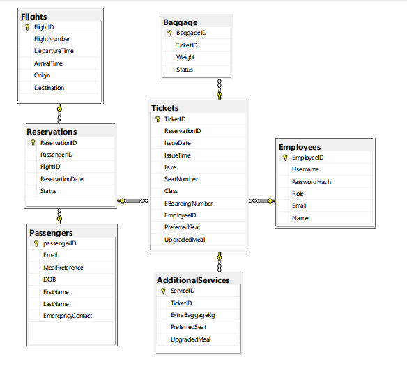

# ✈️ Prebooked Flights - Airline Booking System (SQL Project)


## 📌 Project Description

This project simulates a simplified airline reservation system using SQL. It demonstrates core database concepts including schema design, data integrity constraints, table relationships, and sample data population.

---

## 🧱 Project Overview

- **Database Name:** PrebookedFlights  
- **Tech Stack:** Microsoft SQL Server (T-SQL)  
- **Entities:** Employees, Passengers, Flights, Reservations, Tickets, Baggage, AdditionalServices

---

## ✨ Key Features

- Role-based employee structure  
- Meal preferences and emergency contact tracking for passengers  
- Flight scheduling and reservation management  
- Ticket issuance with class and service options  
- Baggage weight tracking  
- Additional services like upgraded meals and preferred seating  

---

## 📊 ER Diagram

This Entity Relationship (ER) diagram visualizes the schema design:



---

## 📁 File Structure

- `sql-scripts/studentid_task1.sql` – Table creation scripts and constraints  
- `sample-data/insert_sample_data.sql` – Sample insert statements to populate the database  
- `diagrams/ER_diagram.PNG` – Visual ER diagram  

---

## 🔍 Sample Queries

1. Identify Passengers with Pending Reservations
   
```sql
SELECT 
    p.PassengerID,
    p.FirstName,
    p.LastName,
    r.ReservationID,
    r.Status
FROM Passengers p
JOIN Reservations r ON p.PassengerID = r.PassengerID
WHERE r.Status = 'Pending';

```

2. Identify Passengers Over Age 40

```sql
SELECT 
    PassengerID,
    FirstName,
    LastName,
    DOB,
    DATEDIFF(YEAR, DOB, GETDATE()) AS Age
FROM Passengers
WHERE DATEDIFF(YEAR, DOB, GETDATE()) > 40;

```

3. Stored Procedure: Search Passengers by Last Name (Most Recent Ticket First)

```sql
CREATE PROCEDURE SearchPassengerByLastName
    @LastName NVARCHAR(50)
AS
BEGIN
    SELECT 
        p.PassengerID,
        p.FirstName,
        p.LastName,
        t.TicketID,
        t.EBoardingNumber,
        t.IssueDate,
        t.IssueTime
    FROM Passengers p
    JOIN Reservations r ON p.PassengerID = r.PassengerID
    JOIN Tickets t ON r.ReservationID = t.ReservationID
    WHERE p.LastName LIKE '%' + @LastName + '%'
    ORDER BY t.IssueDate DESC, t.IssueTime DESC;
END;
```

---
🧠 What I Learned
* Designing normalized relational databases

* Enforcing data integrity with primary and foreign keys

* Populating tables with realistic sample data using INSERT

* Updating table structures using ALTER TABLE

* Applying business logic through constraints (CHECK, DEFAULT, etc.)

---
✅ Conclusion
This project has strengthened my understanding of database development and T-SQL querying. It simulates real-world
booking operations while following sound relational design principles.

Thank you for viewing my project. Feedback and suggestions are always welcome!

